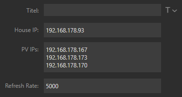
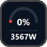
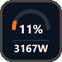
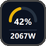
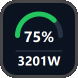
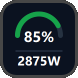

# PV Live Metrics for Stream Deck


A lightweight Stream Deck plugin that displays **live photovoltaic (PV) self-consumption** using Shelly energy meters.

This plugin uses the Shelly Gen1 HTTP API and is not affiliated with or endorsed by Shelly.

The key shows:

- ☀️ Current PV self-sufficiency (%)
- ⚡ Current household power consumption (W)
- 🎨 Color-coded gauge indicating the current PV coverage

The display updates automatically at a configurable interval.

## Features

- Real-time PV monitoring
- Supports multiple PV Shelly meters
- Uses a single Shelly house meter
- Automatic refresh
- Lightweight SVG rendering (no external graphics)
- Manual refresh by pressing the key
- Offline/error handling

## Requirements

### Compatibility

- Stream Deck: ≥ 7.4

- Stream Deck SDK: v3

- Shelly devices: Shelly Gen1 HTTP API

- Node.js: v24 (dev only)

This plugin currently supports the following Shelly devices:

### House Meter

A Shelly device exposing:

```
http://<house-ip>/status
```

with the field:

```json
{
  "total_power": 1234
}
```

### PV Meters

One or more Shelly devices exposing:

```
http://<pv-ip>/meter/0
```

with the field:

```json
{
  "power": 820
}
```

Multiple PV systems are supported by entering one IP address per line.

## How it works

The plugin calculates the current household consumption from:

```
House Consumption = PV Generation + Grid Power
```

where:

- Grid Power:
  - positive = importing electricity from the grid
  - negative = exporting excess PV energy to the grid

The displayed percentage is:

```
PV Coverage = PV Generation / House Consumption
```

Values above 100% are capped at 100%.

## Configuration

| Setting | Description |
|---------|-------------|
| House Meter IP | IP address of the Shelly measuring grid import/export |
| PV Meter IPs | One IP address per line |
| Refresh Interval | Update interval in milliseconds (minimum: 1000 ms) |

Example:



## Display

The gauge color reflects current PV coverage and adapts dynamically based on real-time energy data:

| Coverage range | State | Color | Preview |
|----------------|-------|-------|----------|
| < 5% | No / critical PV coverage | 🔴 Red |  |
| 5–25% | Low solar contribution | 🟠 Orange |  |
| 25–60% | Moderate solar usage | 🟡 Yellow |  |
| 60–85% | Strong solar production | 🟢 Green |  |
| ≥ 85% | Peak / near full coverage | 🟢 Dark Green |  |

> **Note**: The preview screenshots use simulated values and do not reflect real household consumption.

## Error Handling

If the configuration is invalid:

```
SETUP
```

is displayed.

If communication with the devices fails:

```
ERROR
```

is displayed.

When multiple PV meters are configured, unavailable PV meters are ignored while available ones continue to contribute to the total generation.

## Developing

### Prerequisites

This plugin requires the **Elgato Stream Deck SDK**.

Make sure you have:

- Stream Deck Desktop App installed
- A valid Stream Deck SDK setup (used for linking and packaging plugins)

### Setup (first time only)

Install dependencies:

```bash
npm install
```

Link the plugin to Stream Deck (required for live development):

```bash
streamdeck link de.cedrik.pv-live-metrics.sdPlugin
```

### Start development mode

Run TypeScript watcher for live rebuilds:

```bash
npm run watch
```

Any changes will automatically rebuild the plugin and update Stream Deck.

## Production build

Install dependencies:

```bash
npm install
```

To create a production-ready build:

```bash
npm run build
```

After building the plugin, use the Stream Deck SDK tooling to package it:

```bash
streamdeck pack de.cedrik.pv-live-metrics.sdPlugin
```

This generates a `.streamDeckPlugin` file that can be installed or distributed.

## License

This project is licensed under the MIT License. See [LICENSE](./LICENSE) for details.

## Official Documentation
- Getting Started:
https://docs.elgato.com/streamdeck/sdk/introduction/getting-started